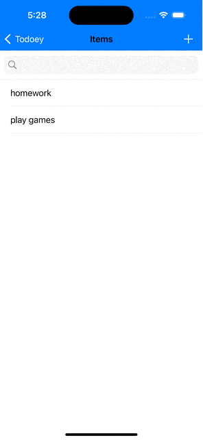

     

# Todoey ✓

## Goal

To-Do List app that let you create categories in the list and you can add items within those categories. 
The objective is to understand how to save data in iOS. This project have three commits, one for each way to save data: using UserDefaults, Core Data and Realm.

## What you will learn

TableViewContorllers
Integrating 3rd party libraries
Saving data using UserDefaults, custom pList
Saving data using CoreData - SQlite
Saving data using Realm - MongoDB/RealmSwift

>This app/project created with the help of App Brewery's course resources
